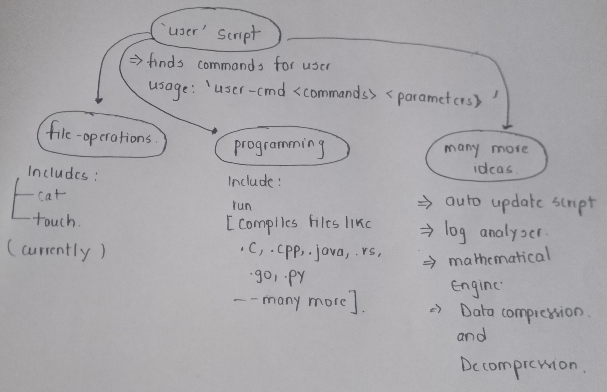

# *Hi,*
### First of all thank for taking intrest in this project.

Follow the guide properly to understand my intention of continuing this project.

## Objective

- To easy-out the over complicated commands by grouping based on `my/our` preferences.
- Understandable and open source.
- Customisable
- Intresting for developers to `time-pass`


## So what is this about?

Currently, this project in the development phase and slowly will cover most of the important tasks which can be done easily within PowerShell (related to scripting only).

- ### What I have covered!
    1. Basic file operation commands: `cat`, `touch`
    2. Compile commands: `run`

    **Why have I done this?**  
    The main reason is that I have some personal-experience of operating `Linux` and I liked it. But PowerShell being the default terminal for `Windows` does not have those features for developers.
    What they included is a long script which cannot be memorized for longer.
    For example: `New-Item` `Get-Content` `Set-Content` (hard for newbie like me!!)

- ### What I want to cover in future:
    There are some future implementations I have thought of, contributions are most welcome :) ):
    1. auto update script
    2. Log analyser (useful for analysts)
    3. Mathematical Engine (Can do offline task without needing online help)
    4. Data compressor and Decompressor (not that necessary, exploitation part only)


## Usage:

The idea of implementation is easy and very-understanding. Consider having everything organised in a proper directory format and grouping your scripting based on their implementation. 

> I have used the same **ideology**.  

**Visuals for better understanding**  
<div style="text-align: center;">

</div>

So, what have you understood. The main mechanism for this to imply is that `user.ps1` script searches the custom scripts `<target>.ps1` from available directories and finds the target script, passes the parameters to target script and continues to execute. *Easy right??*

---

```
This project is open-source and anyone can participate.
```